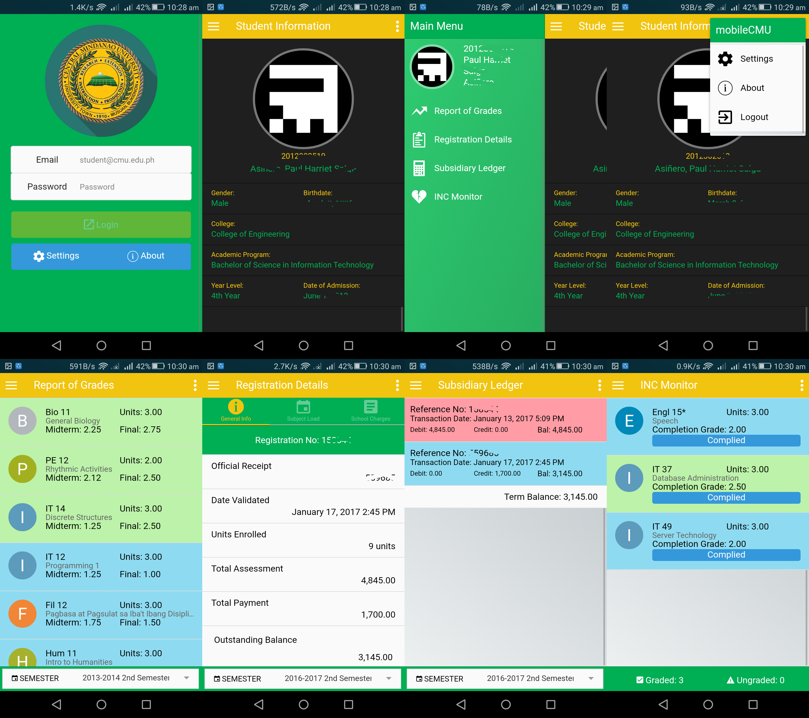

# mobilecmu-mobile
mobileCMU is a mobile application that provides a friendly interaction from the
student portal of Central Mindanao University. This mobile app is built using
[Ionic v1](https://ionicframework.com/docs/v1/), a framework for creating
awesome hybrid mobile applications.

This app is an output of the Capstone Project entitled:

**CENTRAL MINDANAO UNIVERSITY STUDENT PORTAL MOBILE APPLICATION USING HYBRID APPROACH**

## Setup
1. Clone this repository.
2. Install Node, Ionic v1, and Cordova.
3. Run `npm install` command to install dependencies.

## Requirements
### Software
* Android v4.4 or higher
* Android System WebView

### Hardware 
* Android Device
* At least 6 MB storage

## Backend
This mobile app consumes data coming from a Backend API built on Laravel 5.
The code for this Backend API is found at the repository
[@harriebird/mobilecmu-api](https://github.com/harriebird/mobilecmu-api).

## License
Code released under the [MIT License](LICENSE)
